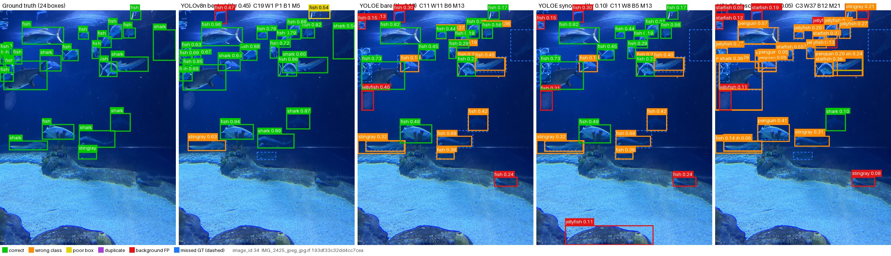
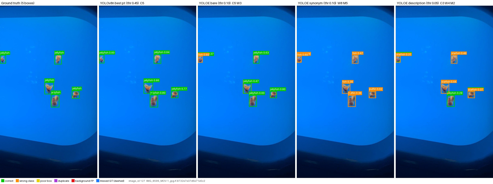
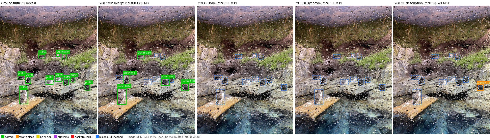

# Section 8: Error Analysis

Author: Trần Nam. Draft for `11_6_Report`. Counts come from `reports/05_qualitative_overlays/error_breakdown.csv` (all 127 validation images).

## 8.1 What kind of mistakes each model makes

Each model is shown at its own best score threshold (YOLOv8n 0.45; YOLOE 0.10, or 0.05 with descriptions). A box counts as correct if it has the right class and overlaps the object by IoU ≥ 0.5.

| Model | Correct boxes | Wrong class | Background | Missed objects (of 909) |
|---|---:|---:|---:|---:|
| YOLOv8n | 654 | 22 | 87 | 255 |
| YOLOE, names | 390 | **291** | 336 | **519** |
| YOLOE, descriptions | 121 | **734** | 558 | **788** |

- **YOLOv8n** is usually right when it draws a box. Its main mistake is **missing objects**, mostly small fish in crowded scenes.
- **YOLOE** often finds the object but gives it the **wrong name** (291 boxes). It also misses more than half of the objects.

## 8.2 Main reasons

**1. Sharks are called "fish".** YOLOE gets only 3 of the 57 sharks right, and it labels 41 sharks as `fish`. Sharks are not small, and YOLOv8n handles them well (44.7 AP). The problem is the name: a shark is also a kind of fish, so the word `fish` wins. (Figure 8.1)

**2. Small birds in groups.** Puffins and penguins are the smallest objects, and both models score worst on them. In one image with 11 puffins behind wet glass, YOLOE finds none and YOLOv8n finds 5. (Figure 8.3)

**3. One word can help or hurt one class.**
- Changing `jellyfish` to `sea jelly` makes YOLOE call real jellyfish `fish`: this mistake goes from 35 to 56 cases, and jellyfish AP drops by 9.9.
- Changing `starfish` to `sea star` raises starfish AP by 7.7.
- The other five classes stay almost the same. (Figure 8.2)

**4. Long descriptions confuse the model.** With descriptions, YOLOE misses 442 of the 459 fish. The fish description ("swimming animal with fins and a tail") is too general, so fish get labelled as shark, penguin or starfish (more than 100 boxes each). Only starfish improves, because its description names a shape no other class has ("star-shaped").

## 8.3 Figures

Each figure shows one image five times: ground truth | YOLOv8n | YOLOE names | YOLOE synonyms | YOLOE descriptions. Colours: green = correct, orange = wrong class, red = background, blue dashed = missed. Images: Roboflow 100 Aquarium v2, CC BY 4.0.

**Figure 8.1: sharks labelled as fish (`val_034`).** YOLOv8n gets 19 correct. YOLOE gets 11 correct and 11 wrong class, and most sharks get orange `fish` boxes.

**Figure 8.2: `sea jelly` hurts (`val_127`).** With names, YOLOE finds all 5 jellyfish. With `sea jelly`, the same boxes are labelled `fish` or `puffin`.

**Figure 8.3: small puffins (`val_047`).** YOLOE misses all 11 puffins with every prompt set; YOLOv8n finds 5.

## 8.4 Limits

- The figures explain the numbers; they are not extra proof.
- The thresholds were picked on the same validation images.
- Some labels in the dataset are unclear, e.g. tiny or hidden fish.
