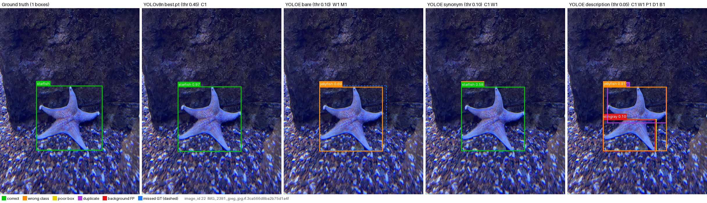
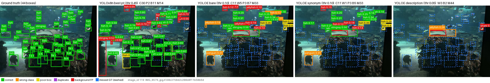

# 11_6_Report — Section 8: Error and Qualitative Analysis

**Status:** draft for the report. Author: Trần Nam; error analysis is shared with Chu Ngọc Minh Khôi (split by workload).

**Sources** (repo commit `564d49f`):
- `reports/05_qualitative_overlays/`: `README.md`, `error_breakdown.csv`, `manifest.json` and 16 figures;
- `reports/04_per_class_ap/`;
- `reports/03_setup3_data_efficiency/`;
- `reports/06_demo/`;
- ground-truth statistics from Section 4.5 (`scripts/analysis/gt_stats.py`).

No model was run for this section. All counts come from the stored predictions.

---

## 8.1 Method

**Images.** All 127 validation images are analysed. Five prediction sets are compared:
- YOLOv8n (`best.pt`, seed 0);
- YOLOE-26s with the bare, synonym and description prompts.

**Display threshold.** Each set is shown at its own score threshold, the one that maximises F1 at IoU 0.5 over the validation split:

| Set | Threshold | F1 |
|---|---:|---:|
| YOLOv8n | 0.45 | 0.76 |
| YOLOE bare | 0.10 | 0.38 |
| YOLOE synonym | 0.10 | 0.36 |
| YOLOE description | 0.05 | 0.10 |

A single shared threshold would leave YOLOE almost empty. AP itself is computed at conf 0.001 and does not depend on these thresholds.

**Detection categories.** Each detection is assigned to one category:
- **correct:** right class, IoU ≥ 0.5;
- **wrong class:** the box sits on a ground-truth object (IoU ≥ 0.5) of another class;
- **poor box:** right class, 0.1 ≤ IoU < 0.5;
- **duplicate;**
- **background:** no object nearby.

Ground-truth boxes left unmatched are **missed**.

**Figure selection.** The 16 paired figures (GT | YOLOv8n | YOLOE ×3) were chosen by a fixed rule decided before looking at any figure:
- the image with the most boxes of each class (7 figures);
- the 3 most extreme images for each of three contrasts (9 figures): bare vs synonym, bare vs description, and YOLOv8n vs YOLOE bare.

Contrast-selected images are extreme by construction. They illustrate mechanisms and are not typical results.

## 8.2 Error breakdown

Counts over all 127 images at the display thresholds (`error_breakdown.csv`):

| Model | Boxes shown | Correct | Wrong class | Poor box | Duplicate | Background | Missed (of 909) |
|---|---:|---:|---:|---:|---:|---:|---:|
| YOLOv8n | 814 | 654 (80 %) | 22 (3 %) | 43 (5 %) | 8 | 87 (11 %) | 255 (28 %) |
| YOLOE bare | 1,123 | 390 (35 %) | **291 (26 %)** | 81 (7 %) | 25 | 336 (30 %) | **519 (57 %)** |
| YOLOE synonym | 1,039 | 350 (34 %) | 282 (27 %) | 73 (7 %) | 19 | 315 (30 %) | 559 (61 %) |
| YOLOE description | 1,482 | 121 (8 %) | **734 (50 %)** | 55 (4 %) | 14 | 558 (38 %) | **788 (87 %)** |

Percentages for each model's own boxes are out of "Boxes shown". Percentages for missed objects are out of the 909 ground-truth boxes.

**The two models fail in different ways:**
- **YOLOv8n's main error is missing objects** (255). Over half of them are fish: 137 of the 459 fish are missed. The missed fish are smaller than the fish it detects (median 0.57 % vs 0.88 % of the image area). When YOLOv8n does output a box, it is usually right: 80 % of its boxes are correct, and only 3 % carry the wrong class.
- **YOLOE's main error is naming, not finding.** Over a quarter of its boxes (291) sit on a real object but carry the wrong class, about 13× YOLOv8n's count. Another 30 % are background boxes, and it misses 57 % of the objects.
- **Box tightness is a smaller factor.** Poor boxes are 7 % of YOLOE's output against 5 % for YOLOv8n. YOLOE does lose more at strict IoU (AP75/AP50 = 11.8/23.0 = 0.51, against 44.9/74.8 = 0.60 for YOLOv8n `last.pt`). The bigger losses, however, come from wrong labels and missed objects.

## 8.3 Class-by-class causes

Most frequent wrong-class confusions (ground truth → predicted), from `manifest.json`:

| Set | Top confusions |
|---|---|
| YOLOE bare | fish → jellyfish 50, **shark → fish 41**, jellyfish → fish 35, fish → stingray 27, fish → puffin 27, penguin → puffin 17 |
| YOLOE synonym | **jellyfish → fish 56** (was 35), fish → jellyfish 4 (was 50) |
| YOLOE description | **fish → shark 112, fish → penguin 110, fish → starfish 108** |
| YOLOv8n | fish → shark 5, shark → fish 5, fish → stingray 3 |

**Shark: a naming problem in the label hierarchy (YOLOE's worst class, 5.4 AP).**
- YOLOE finds only 3 of the 57 validation sharks correctly and misses 54.
- In 41 cases it puts a box on a shark but labels it `fish`.
- Sharks are not small: their median box is ~63 px at the model's input size (4.5), and YOLOv8n reaches 44.7 AP on them.
- So the failure is not detection but **naming**. A shark is a kind of fish, both visually and in everyday language, and the more general prompt `fish` wins the match.
- Example: `val_034`, a mixed tank with 17 fish, 6 sharks and 1 stingray. YOLOv8n gets 19 correct; YOLOE bare gets 11 correct and 11 wrong-class.
- The demo confirms the pattern. On the same tank, the prompts "shark, rock" find no shark at conf 0.25, while YOLOv8n finds 5 sharks (`reports/06_demo`).

**Puffin and penguin: small, grouped birds (puffin is the weakest class for both models).**
- Puffins and penguins have the smallest boxes in the dataset (~35 px) and appear in groups (4.5).
- YOLOv8n is weakest on exactly these two classes: puffin 25.0 and penguin 30.5 AP (`last.pt`).
- YOLOE finds 17 of 74 puffins. Many of its `puffin` boxes are actually fish (27) or penguins (17).
- Example: `val_047` shows eleven small puffins on rocks behind rain-spattered glass. YOLOE misses all 11 under every wording; YOLOv8n finds 5.
- Labels also help less here. In Setup 3, YOLOv8n trained on 45 images still trails zero-shot YOLOE on puffin (3.5 vs 6.2 AP), because those subsets contain only 2–5 puffin images. Puffin is the last class where supervision overtakes YOLOE: between 45 and 112 images.

**Fish: crowds and small objects.**
- `fish` is YOLOE's best class (19.6 AP), yet it still misses 229 of 459 fish.
- Example: `val_119` is a school of 43 fish.
  - YOLOv8n: 30 correct, 14 missed, 11 background boxes.
  - YOLOE bare: 11 correct, 33 missed.
  - YOLOE descriptions: 0 correct.
- Crowding and small size hurt both models. The supervised model has learned this domain's fish and recovers far more of them.

**Jellyfish and starfish: wording changes the label, not the box (Setup 2).**
- **"sea jelly" (−9.9 AP).** In `val_127`, bare YOLOE finds all 5 jellyfish. With `sea jelly`, all 5 boxes stay in place but are relabelled `fish` or `puffin`: 0 correct, 5 missed. Over the whole split, jellyfish → fish rises from 35 to 56 confusions. The detector still sees the objects; the rarer word simply matches its embedding worse than `fish` does.
- **"sea star" (+7.7 AP).** In `val_022`, bare YOLOE labels a starfish `jellyfish` (0.69). With `sea star` the object gets a correct box (0.58), plus a weaker `sea jelly` box on the same object (0.45). YOLOv8n gets it at 0.97.
- **The effect stays local.** The other five prompts are identical in both sets, and their AP moves by at most 0.3 points. Only the classes whose prompt changed are affected.

**Descriptions: generic phrases lose to specific ones.**
- The description set loses AP on six classes, and fish collapses from 19.6 to 1.6 AP: 442 of 459 fish are missed.
- The top three confusions all start from fish: fish → shark 112, fish → penguin 110, fish → starfish 108.
- **Hypothesis (consistent with the counts, not tested in isolation):**
  - The fish description, "swimming animal with fins and a tail", is generic.
  - The more specific phrases of other classes win the match on fish boxes. The shark phrase even contains the word *fish* ("large fish with a dorsal fin…").
- **The exception is starfish (+9.5 AP).** Its description names a shape no other class shares ("star-shaped… radiating arms").
- Wording matters most when it **separates** a class from the others, not when it merely describes it.

## 8.4 Summary of causes

| Error pattern | Main evidence | Likely cause |
|---|---|---|
| YOLOE labels sharks as fish | shark → fish 41; 54/57 sharks missed; YOLOv8n 44.7 AP on shark | Overlapping concepts: the general prompt `fish` outscores `shark` |
| Both models weak on puffin and penguin | Smallest boxes (~35 px), in groups; YOLOv8n's two lowest AP; `val_047` | Small, clustered objects and poor image quality. Few training examples for the supervised model. |
| Many missed fish (both models) | 137 (YOLOv8n) and 229 (YOLOE) of 459 missed; missed fish are smaller | Crowded schools and small objects |
| Synonym helps or hurts one class | jellyfish → fish 35 → 56 with `sea jelly`; `sea star` +7.7 AP | The word's match to the text embedding; boxes stay in place, labels change |
| Descriptions collapse most classes | 734 wrong-class boxes; fish → shark/penguin/starfish > 100 each | Generic, overlapping descriptions; only a distinctive phrase (starfish) helps |

## 8.5 Limitations of this analysis

- **Explanations, not evidence.** The figures illustrate the aggregate numbers but are not extra evidence; one image does not establish an effect.
- **Thresholds chosen on displayed data.** The display thresholds were picked on the same validation images that are displayed.
- **IoU 0.5 cut-off.** It decides "correct" vs "poor box", whereas COCO AP averages over IoU 0.50–0.95.
- **Checkpoint mismatch.** The error breakdown uses YOLOv8n `best.pt`, while the Setup 1 headline uses `last.pt` (44.4 vs 45.4 AP).
- **Debatable labels.** Some ground-truth labels are debatable (tiny or occluded fish) and were not relabelled.
- **Partial visual review.** Not every figure was checked box by box (`reports/VERIFICATION.md` reviewed `val_022`, `val_047` and `val_127`).

## 8.6 Figures for the report

Each figure shows one validation image five times: ground truth | YOLOv8n `best.pt` | YOLOE bare | YOLOE synonym | YOLOE description. Each model is shown at its display threshold from 8.1. Box colours: green = correct, orange = wrong class, yellow = poor box, purple = duplicate, red = background, blue dashed = missed. Images: Roboflow 100 Aquarium v2 (`aquarium-qlnqy`), CC BY 4.0.

**Figure 8.1: `val_034`, shark → fish.** A mixed tank: 17 fish, 6 sharks, 1 stingray. YOLOv8n gets 19 correct. YOLOE bare gets 11 correct and 11 wrong-class; most of the sharks in the lower half get orange `fish` boxes.

**Figure 8.2: `val_127`, "sea jelly" hurts.** Bare YOLOE finds all 5 jellyfish. With `sea jelly`, the boxes stay in place but are relabelled `fish` or `puffin`: 0 correct.

**Figure 8.3: `val_022`, "sea star" helps.** Bare YOLOE labels the starfish `jellyfish` (0.69). With `sea star` it is correct (0.58), plus a weaker `sea jelly` box on the same object (0.45).

**Figure 8.4: `val_047`, small puffins.** Eleven puffins on rocks behind rain-spattered glass. YOLOE misses all 11 under every wording; YOLOv8n finds 5.

**Figure 8.5: `val_119`, a crowded school of 43 fish.** YOLOv8n: 30 correct, 14 missed. YOLOE bare: 11 correct, 33 missed. YOLOE descriptions: 0 correct.

The figure selection rule and all 16 figures are in `reports/05_qualitative_overlays/`.
