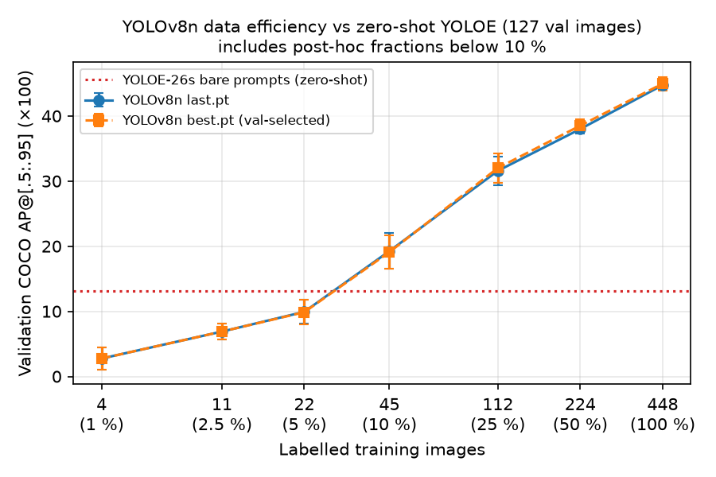

# Setup 3: how many labelled images does YOLOv8n need to beat zero-shot YOLOE?

The protocol was written **before** any training: see `PROTOCOL.md`, including the post-hoc addendum.

- **What changes:** only the number of labelled training images. Nested random subsets of the 448 training images are used, with 3 seeds per fraction.
- **What stays fixed:** everything else is the shared YOLOv8n protocol: 100 epochs, no early stopping, the same optimizer and augmentation, and COCO-pretrained initialisation.
- **How it's scored:** the 127 validation images with the same COCOeval and inference settings as YOLOE.
- **Primary number:** `last.pt`, because `best.pt` is chosen on validation. The reference is YOLOE-26s with bare class names, at **13.1 AP**.



## Predeclared result (10 / 25 / 50 / 100 %)

| Labelled train images | AP, last.pt (mean ± std, 3 seeds) | AP50, last.pt | AP, best.pt | Above YOLOE bare (13.1)? |
|---|---:|---:|---:|---|
| 45 (10 %) | 19.2 ± 2.7 | 36.4 ± 3.4 | 19.1 ± 2.5 | yes, all 3 seeds (seeds 0/1/2: 18.6 / 22.2 / 16.9) |
| 112 (25 %) | 31.6 ± 2.2 | 55.0 ± 3.5 | 32.0 ± 2.2 | yes |
| 224 (50 %) | 38.0 ± 0.7 | 64.8 ± 0.7 | 38.5 ± 1.0 | yes |
| 448 (100 %) | 44.7 ± 0.7 | 74.9 ± 0.3 | 45.0 ± 1.0 | yes |

**Answer to the predeclared question: ≤ 10 %, so 45 labelled images are enough.** Even the worst 10 % seed beats the zero-shot model by 3.8 AP points. Files: `tables.md`, `setup3_runs.csv`, `summary.json`, `data_efficiency.png`.

## Post-hoc follow-up: where the curves cross (1 / 2.5 / 5 %)

These fractions were added after the result above, so they are labelled as post-hoc.

| Labelled train images | AP, last.pt | Seeds 0 / 1 / 2 | Above YOLOE bare? |
|---|---:|---|---|
| 4 (1 %) | 2.7 ± 1.7 | 0.8 / 4.1 / 3.3 | no |
| 11 (2.5 %) | 6.9 ± 1.2 | 6.6 / 8.2 / 5.9 | no |
| 22 (5 %) | 9.9 ± 1.8 | 9.1 / 12.0 / 8.7 | no (best seed 12.0) |
| 45 (10 %) | 19.2 ± 2.7 | 18.6 / 22.2 / 16.9 | yes |

**The crossover lies between 22 and 45 labelled images.** Interpolating linearly on the log scale puts it at roughly 28 images, about 6 % of the training set. That estimate comes from only two points, so the defensible claim is the bracket, 22–45 images. Files: `posthoc_small_fractions/`. The 4- and 11-image runs were still improving at epoch 100, and the 22-image runs had only just levelled off (see Training curves). With longer training the crossover could therefore fall below 22 images; 45 is an upper bound.

## Per-class view (last.pt, mean of 3 seeds, ×100)

| Labelled images | fish | jellyfish | penguin | puffin | shark | starfish | stingray |
|---|---:|---:|---:|---:|---:|---:|---:|
| 22 (5 %, post-hoc) | 15.3 | 22.6 | 12.9 | 2.8 | 5.2 | 3.6 | 7.0 |
| 45 (10 %) | 21.7 | 27.4 | 18.6 | **3.5** | 17.1 | 23.4 | 23.2 |
| 112 (25 %) | 33.4 | 35.5 | 25.4 | 10.9 | 32.8 | 41.7 | 41.4 |
| 448 (100 %) | 43.8 | 52.7 | 31.5 | 27.0 | 44.1 | 54.4 | 59.8 |
| YOLOE bare, zero-shot | 19.6 | 12.8 | 11.2 | **6.2** | 5.4 | 17.7 | 18.7 |

- **Different classes cross at different points.** At 45 images, YOLOv8n beats YOLOE on six of the seven classes but **not puffin** (3.5 vs 6.2). Puffin only passes YOLOE between 45 and 112 images. At 22 images YOLOE still wins on fish, puffin, starfish and stingray and roughly ties on shark (5.4 vs 5.2). Jellyfish is overtaken earliest. With 4 images, two of three seeds already match or beat YOLOE (23.0 and 13.3 vs 12.8); the third seed had no jellyfish in its 4 images and scores 0. With 11 images all seeds pass it (12.5–29.6 vs 12.8).
- **Why puffin is likely slow.** At 10 % only 2–5 training images contain puffins (`tables.md`, subset table). Puffins are also among the smallest objects relative to the image, and they appear in groups.
- **Starfish.** It has only 27 validation boxes, so a few images move its AP. Its seed spread (4.2–7.2 points at 10–50 %) is nonetheless typical of the classes here.

## Training curves (`train_artifacts/<run>/results.csv` and `results.png`)

Summary of the 21 runs. mAP50-95 here is Ultralytics' per-epoch validation metric from `results.csv`, not the COCOeval AP above.

| Labelled images | Best epoch (3 seeds) | Epoch reaching 95 % of the run's best | Change over the last 10 epochs | Train time (min) |
|---|---|---|---|---:|
| 4 | 100 / 100 / 100 | 91–100 | +0.3 each | 1.5–1.8 |
| 11 | 100 / 100 / 100 | 94–97 | +0.7 to +1.0 | 1.7 |
| 22 | 96 / 90 / 100 | 68–88 | 0.0 to +0.3 | 1.6 |
| 45 | 83 / 79 / 93 | 65–77 | −0.5 to +0.7 | 1.7 |
| 112 | 98 / 81 / 91 | 58–75 | −1.6 to +0.4 | 2.3–2.4 |
| 224 | 88 / 80 / 84 | 52–70 | −1.1 to +0.9 | 3.3–3.4 |
| 448 | 86 / 77 / 77 | 38–59 | −0.1 to +1.2 | 5.2–5.7 |

- **The 4- and 11-image runs had not converged.** Every seed's best epoch is the last one, and validation mAP was still rising over the final 10 epochs. Their AP is therefore a lower bound for that amount of labelled data, and longer training could move the crossover with YOLOE below 22 images.
- **From 22 images up the curves flatten out.** 95 % of each run's best is reached by epoch 38–88, and the last 10 epochs change the metric by at most 1.6 points in either direction (one 22-image seed still peaks at epoch 100). Validation classification loss rises by at most 6 % after its minimum, so late overfitting is mild, and `last.pt` is within 1.7 points (Ultralytics mAP50-95) of each run's best epoch.
- `confusion_matrix_normalized.png` in each folder is Ultralytics' end-of-training validation confusion matrix for `best.pt`. It complements the per-class AP tables, and no separate numbers are derived from it here.

## Interpretation for the report

The zero-shot text-prompted model is worth roughly **22–45 labelled images** of this dataset: about 5–10 % of the 448-image training set, with a log-interpolated estimate of about 28 images under the fixed 100-epoch schedule (possibly fewer with longer training of the small subsets). Beyond that, supervised fine-tuning keeps improving, with no plateau by 448 images: +6.7 AP from 50 % to 100 %. YOLOE's advantage is therefore the setting with **no or very few labels, or classes not known in advance**, not this fully labelled closed-set benchmark. A combined approach, such as fine-tuning YOLOE itself on few labels, was not tested.

## Limitations

- **Epochs are fixed at 100,** so a 4-image subset gets 100 training iterations and the full set gets 2,800. With batch 16 and Ultralytics' gradient accumulation to a nominal batch of 64, that is about 34 vs 719 optimizer steps (simulated from the trainer's own warm-up and accumulation rules). "Fewer labels" here includes "fewer updates". The training curves above confirm that the 4- and 11-image runs were still improving at epoch 100, so a longer or step-matched schedule would likely raise those points. That was not tested.
- **Subsets are uniform random samples, not class-stratified.** Small subsets have uneven class coverage, which is recorded per seed in `tables.md`.
- **Only 3 seeds,** and validation-only (the test split is not used in Setup 3). The YOLOE reference is a single deterministic run, with no seed variance.
- **The model sizes differ:** YOLOv8n has 3.0 M parameters, and YOLOE-26s has about 15 M plus a text encoder.

## Reproduce

```bash
.venv/bin/python scripts/yolo/data_efficiency.py train         # predeclared fractions, ~40 min on an RTX 3060
.venv/bin/python scripts/yolo/data_efficiency.py evaluate
.venv/bin/python scripts/yolo/data_efficiency.py summarize --yoloe reports/02_setup2_prompt_study/runs/bare/metrics.json
# post-hoc
.venv/bin/python scripts/yolo/data_efficiency.py train --fractions 0.01 0.025 0.05
.venv/bin/python scripts/yolo/data_efficiency.py evaluate --fractions 0.01 0.025 0.05
.venv/bin/python scripts/yolo/data_efficiency.py summarize --yoloe reports/02_setup2_prompt_study/runs/bare/metrics.json \
  --fractions 0.01 0.025 0.05 0.1 0.25 0.5 1.0 --out reports/03_setup3_data_efficiency/posthoc_small_fractions
```

## Stored outputs (nothing needs to be re-run to read them)

| Path | Contents |
|---|---|
| `runs/<run>.json` | Validation AP, AP50 and per-class AP for `last.pt` and `best.pt`, plus training info |
| `eval/<run>/<last\|best>/` | `coco_predictions_valid.json.gz`, every detection at conf ≥ 0.001 (gzip-compressed COCO results), and `cocoeval_valid.txt` |
| `train_artifacts/<run>/` | `args.yaml` (full Ultralytics settings), `experiment.yaml` (aquadet config), `train_info.json`, `results.csv` (per-epoch losses and val metrics), `results.png`, `confusion_matrix_normalized.png` and, for subset runs, `subset.json` (the exact training image list) |
| `subsets.json` | Per-class image and box counts of every subset |

Trained weights (`runs/<run>/weights/*.pt`, about 6 MB each) are not committed; download the official initial checkpoint and rerun training to reproduce them (see `README.md`). The raw training console logs (`train.log`, `train_posthoc.log`, mostly progress bars) are kept only on the machine that ran the experiments; their per-epoch numbers are in each run's `results.csv`. The `summarize` step and every table and plot here can be rebuilt from the stored files alone.
